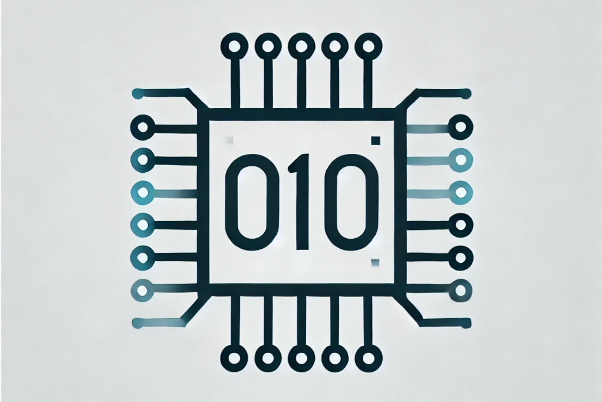

<!--
author:   Tilman Schieber
email:    tilman.schieber@tu-berlin.de
version:  0.0.1
date:     2024
language: de
logo:     img/unterkurs_logo.png
icon:     img/TU_Logo_kurz.png
comment:  Unterkurs Informatik am Studienkolleg der
          Technischen Universität Berlin.
link:     styles/main.css
-->

# Unterkurs Informatik

<!-- class="lead" -->
Willkommen beim Unterkurs Informatik am Studienkolleg der Technischen Universität Berlin.

---

Grundlagen der Informatik
=========================

[preview-lia](1_Aussagenlogik.md)
