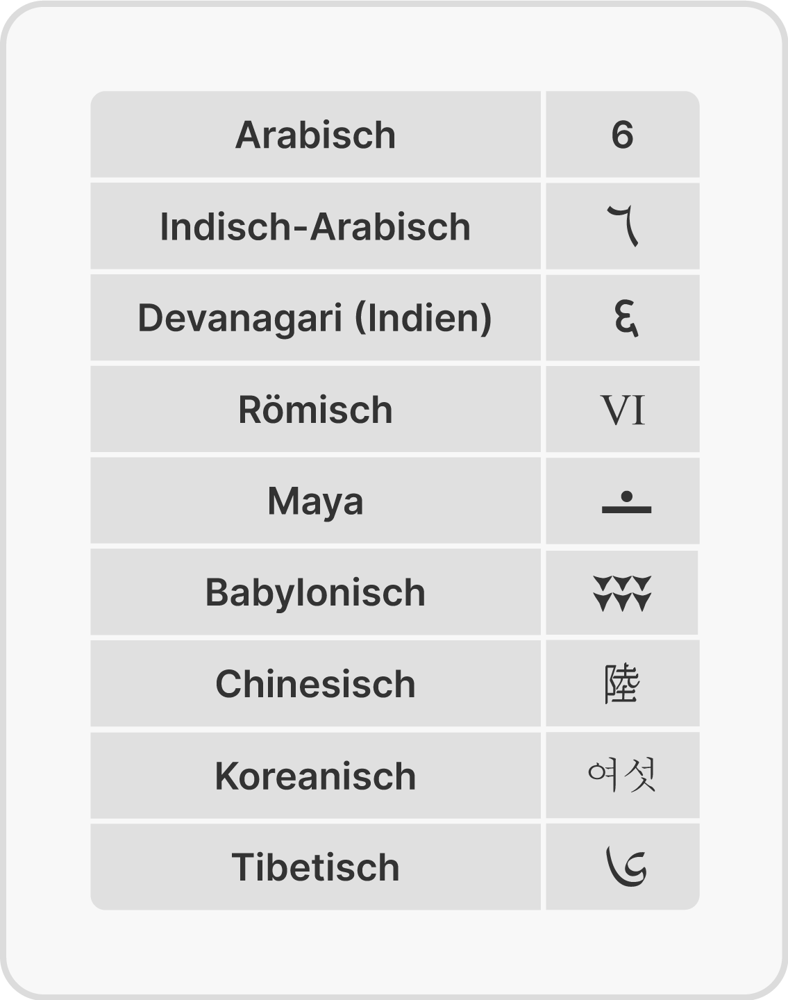
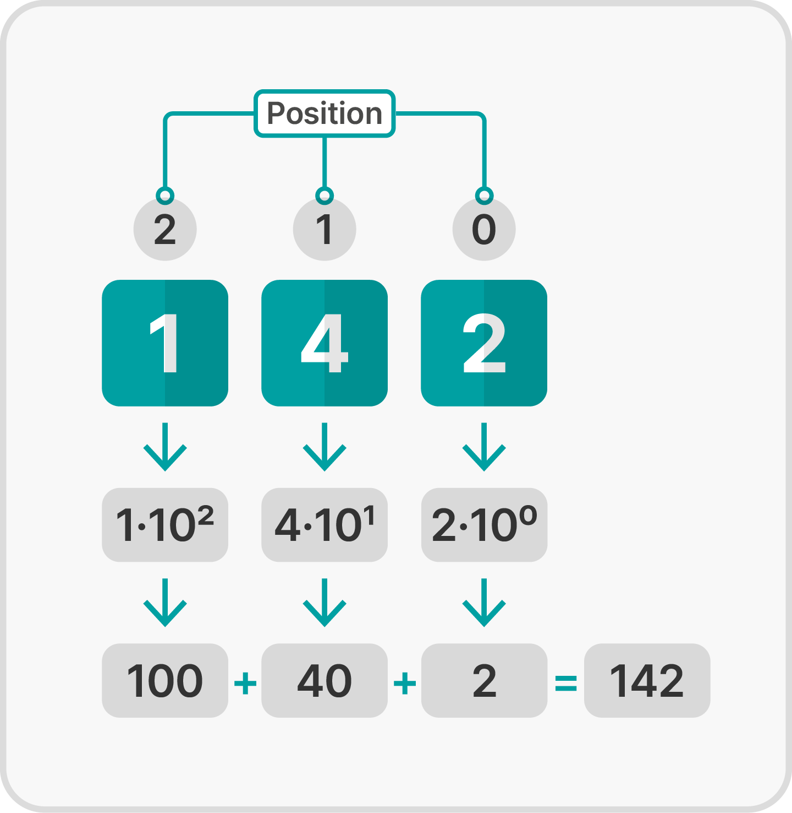
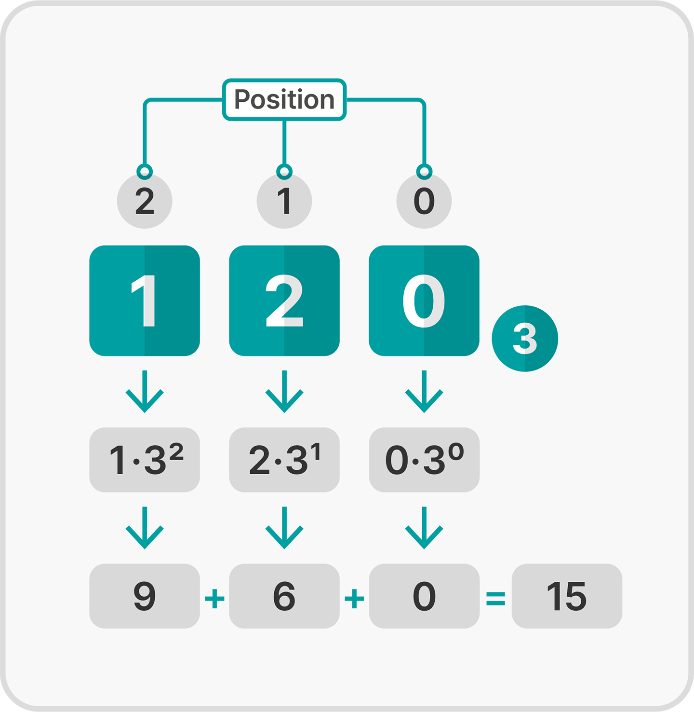
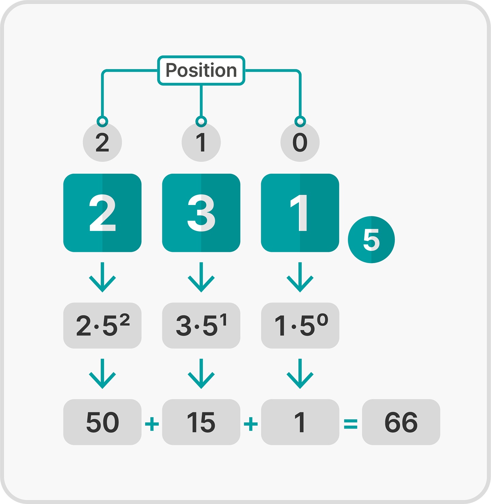

<!--
author:   Tilman Schieber
email:    tilman.schieber@tu-berlin.de
version:  1.0.1
date:     2024
language: de
narrator: Deutsch Female
logo:     img/1/aussagenlogik.png
icon:     img/TU_Logo_kurz.svg
comment:  Positionssysteme, Binär-, Oktal- und Hexadezimalsystem 
link:     styles/main.css
import:   ./macros.md


@style

.katex {
    font-size: 1.1em;
}

table {
  --color-border: 160, 160, 160; 
  }

.lia-table__sort {
  display: none
  }

.lia-table-responsive.has-thead-sticky.has-first-col-sticky .lia-table__head th:first-child {
  position: unset;
}

.lia-table-responsive.has-first-col-sticky .lia-table__data:first-child {
  position: unset;
}


@end

-->

# Zahlensysteme

<div class="flex-container">
<div class="flex-child">


</div>
<div class="flex-child-2">

Es ist wichtig, zwischen einer Zahl und ihrer Darstellung zu unterscheiden.
So können wir die Zahl 142 auch durch das Wort "einhundertzweiundvierzig" beschreiben. 

Alternativ könnten wir eine Strichliste mit 142 Strichen führen oder die römische Zahl ⅭⅩⅬⅠⅠ benutzen.
Eine solche Darstellung nennt man Zahlensystem.

Das heute verbreitetste Zahlensystem ist das Dezimalsystem. Können Sie die Zahl 142 lesen, kennen Sie es bereits.

</div>
</div>


## Das Dezimalsystem

Unser Dezimal- oder Zehnersystem ist ein sogenanntes Positionssystem. Dabei steht jede Ziffer, je nach Position, für einen anderen Wert. 
Die $1$ steht in der Zahl $142$ beispielsweise für $100$, während sie in der Zahl $213$ für $10$ steht.

Die Werte der einzelnen Stellen basieren auf den Potenzen von Zehn: 

$$
1,10,100,1000,10000, \ldots
$$ 

lassen sich als 

$$
10^0,10^1,10^2,10^3,10^4,\ldots
$$
 
schreiben.

Wir sagen dazu auch: das Dezimalsystem hat die Basis $10$.

Um eine Zahl im Dezimalsystem zu lesen, nummerieren wir die Positionen von rechts nach links durch. Wie immer in der Informatik beginnen wir mit dem Zählen bei Null.

Die Wertigkeit einer Ziffer ergibt sich nach der Formel 

$$
\text{Wertigkeit}=\text{Ziffer} \cdot 10^\text{Position}
$$

Der Wert einer Zahl ist die Summe der Wertigkeiten aller ihrer Ziffern.

<div class="flex-container">


<div class="flex-child alert example" style="min-width:500px">

Beispiel
--------

Bei der Zahl 142 steht

* eine $2$ an Position $0$, also $2\cdot10^0$, Wertigkeit $2$
* eine $4$ an Position $1$, also $4\cdot10^1$, Wertigkeit $40$
* eine $1$ an Position $2$, also $1\cdot10^2$, Wertigkeit $100$

So ergibt sich für 142 der Wert

$$
 2 + 40 + 100 = 142 
$$

</div>

<div class="flex-child" style="min-width:300px">



</div>


</div>

## Positionssysteme 

Im Dezimal- oder Zehnersystem basieren die Wertigkeiten aller Stellen auf den Potenzen der Zahl 10. Man sagt, es ist ein Positionssystem zur Basis 10.

Allgemein berechnet sich die Wertigkeit einer Ziffer in einem Zahlensystem zu einer bestimmten Basis so:

$$
\text{Wertigkeit}=\text{Ziffer} \cdot \text{Basis}^\text{Position}
$$

Der Wert einer Zahl in einem Positionssystem ist die Summe der Wertigkeiten der Ziffern.

Mit diesem Wissen kann man nun auch Zahlen verstehen, die nicht im Dezimalsystem sondern mit einer anderen Basis geschrieben wurden.  

Damit es nicht zu Verwechslungen kommt, schreiben wir die Basis rechts unten neben die Zahl: So ist $120_3$ eine Zahl mit Basis 3 und $231_5$ eine Zahl mit Basis 5.  

Bei Zahlen im Dezimalsystem gibt man die Basis 10 üblicherweise nicht an, $24$ bedeutet also $24_{10}$.  
Um die Zahlen $120_3$ und $231_5$ ins Dezimalsystem umzurechnen, berechnen wir die Summe aller Wertigkeiten der Ziffern:


<div class="flex-container">

<div class="flex-child mx-3" style="min-width:300px">



</div>

<div class="flex-child mx-3" style="min-width:300px">



</div>

</div>

---

Versuchen Sie es nun selbst:

<div class="alert exercise">

Welche dieser Zahlen stellen die Dezimalzahl 42 dar?
----------------------------------------------------

- [[X]] $46_{9}$
- [[ ]] $110010_2$
- [[ ]] $1111_3$
- [[X]] $132_5$
- [[X]] $16_{36}$
- [[ ]] $111_6$
*************************

- $46_{9} = 36 + 6 = 42$ ✓
- $110010_2 = 32 +  16 + 2 = 50$ 
- $1111_3 = 27 + 9 + 3 + 1 = 40$ 
- $132_5 = 25 + 15 + 2 = 42$ ✓
- $16_{36} = 36 + 6 = 42$ ✓
- $111_6 = 36 + 6 + 1 = 43$

*************************
</div>

## Binärsystem

Wie wir bereits wissen, arbeiten Computer digital und kennen meist nur zwei verschiedene Zustände: 

1. keine elektrische Spannung liegt an, oder $0$ 
2. elektrische Spannung liegt an, oder $1$

So haben wir nur zwei Symbole, $0$ und $1$ zur Verfügung, um Zahlen darzustellen.
Dies ist das Binärsystem, also das Zahlensystem mit Basis 2. 
Es funktioniert genau wie die anderen Positionssysteme mit einer Basis $b$.
Wir befassen uns aber genauer mit ihm, da es für die Informatik von besonderer Bedeutung ist.


### Binärzahlen lesen

Man interpretiert Binärzahlen genau so wie alle anderen Positionssysteme. 

In diesem Rechner sehen Sie, wie man eine Binärzahl durch Addition der Zweierpotenzen in eine Dezimalzahl umrechnen kann.

*klicken Sie auf die Bits um sie umzuschalten*

<div class="center my-3">

@[embed(style="height: 420px; width:420px; border: none")](html/2/binaerzahlen.html)

</div>

<div class="alert exercise">

Was ist wahr über Binärzahlen?
-------------------------------

- [[X]] Alle Binärzahlen die auf 0 enden sind gerade
- [[ ]] Alle Binärzahlen die auf 10 enden sind durch vier teilbar.
- [[X]] Alle Binärzahlen mit nur einer 1 sind eine Zweierpotenz.
- [[X]] Die größte Binärzahl, die sich mit $n$ Stellen darstellen lässt ist $2^n-1$.
- [[ ]] Alle Binärzahlen mit nur einer 1 sind gerade.

</div>

### Binäre Addition
Man kann man mit binären Zahlen genauso rechnen, wie man es vom Dezimalzahlen gewohnt ist. 
Da es ja aber nur die Ziffern $0$ und $1$ gibt, ergibt schon $1+1=10$ einen Übertrag.

Eine schriftliche Addition mit Binärzahlen kann man so durchführen:

<div class="flex-container">
<div class="flex-child-1 alert exercise">

Übung
-----

Verwenden Sie den Rechner um $0111_2 + 0011_2$ zu addieren. \
Was ist das Ergebnis als Binärzahl? [[ 1010 ]]\
$0111_2$ ist dezimal: [[ 7 ]]\
$0011_2$ ist dezimal: [[ 3 ]]\
Die Summe der Binärzahlen ist also dezimal: [[ 10 ]]
*************************
Sie sehen das Ergebnis ist richtig. $7+3=10$.
*************************

</div>
<div class="flex-child">

@[embed(style="height: 320px; width:300px; border: none")](html/2/binaeraddition.html)

</div>

</div>

#### Übungen: Binäre Addition

> Hier können Sie selbst die binäre Addition üben.
> Am besten lösen Sie die Aufgaben schriftlich und überprüfen es dann hier online. Wenn Sie geübter sind, können Sie die Aufgaben auch im Kopf lösen	
> Geben Sie das Ergebnis stets ohne führende Nullen[^1] an.

<div class="alert exercise">

Addieren Sie die folgenden Binärzahlen:
---------------------------------------

a)
---

`00001111`\
`01110101`

<!-- style= "max-width: 16em; "-->
[[10000100]]

---

b)
---

`01110001`\
`01011010`

<!-- style= "max-width: 16em"-->
[[11001011]]


---

c)
---


`10101111`\
`01001001`

<!-- style= "max-width: 16em"-->
[[11111000]]

---

d)
---

`01011000`\
`00010011`

<!-- style= "max-width: 16em"-->
[[1101011]]

---

e)
---

`0100100100110111`\
`1000000100110111`

<!-- style= "max-width: 20em"-->
[[1100101001101110]]


---

f)
---

`0010110101100010`\
`0010111100001011`

<!-- style= "max-width: 20em"-->
[[101110001101101]]

---

[^1]: Führende Nullen sind Nullen, die vor der ersten Eins stehen. Wenn sie also als Ergebnis $0010$ erhalten, schreiben Sie einfach $10$.

</div>


### Binärmeister 
*Sobald Sie starten, erscheinen immer mehr gelbe Bits auf der linken Seite. Sie können die Bits mit Klicken umschalten, so dass Sie der Zahl rechts davon entsprechen. Sobald sie eine Zeile gelöst haben, verschwindet sie. Bei 8 ungelösten Zeilen haben sie verloren!*
@[embed(style="height: 800px; width:100%; border: none")](html/2/binaermeister.html)


## Oktal- und Hexadezimalsystem
### Oktalzahlen und ihre Umwandlung in Binärzahlen

Neben dem Binärsystem sind das Oktal- und insbesondere das Hexadezimalsystem wichtig für die Informatik. Der Grund dafür ist, dass Binärzahlen sich einfach in Oktal- oder Hexadezimalzahlen umwandeln lassen. So erlauben diese beiden Zahlensysteme Informatikern eine effiziente Darstellung digitaler Daten.

Zunächst können wir am Oktalsystem sehen, wie leicht diese Umwandlung in beide Richtungen geht.
So entspricht jede Ziffer im Oktalsystem genau drei Ziffern im Binärsystem:

<!-- style="max-width:650px"-->
```ascii

Oktal |   0   |   1   |   2   |   3   |   4   |   5   |   6   |   7   
------+-------+-------+-------+-------+-------+-------+-------+------ 
Binär |  000  |  001  |  010  |  011  |  100  |  101  |  110  |  111  
```


<div class="alert example">

Beispiel 1
----------

Die Binärzahl $100 001$ besteht aus den zwei Dreierblöcken $100$ und $001$, also $4$ und $1$, diese Zahl ist also oktal $41$.

Bei der Umwandlung einer Binär- in eine Oktalzahl gehen wir von rechts nach links vor und ergänzen, falls nötig, links Nullen für den letzten Dreierblock.


Beispiel 2
----------


Die Binärzahl $11001_2$ entspricht $011\;001_2$ und damit oktal $31_8$


</div>


<div class="alert tip">

Oktal-zu-Binär-Rechner
-----------------------

> Geben Sie eine Oktalzahl ein und sehen Sie, wie sie in eine Binärzahl umgewandelt wird.

@[embed(style="height: 190px; width:400px; border: none")](html/2/octal.html)

</div>


@[embed(style="height: 210px; width:600px; border: none")](html/2/hex.html)

## Zahlensymbole

Für alle Positionssysteme mit einer Basis $b\leq10$ benutzt man die bekannten Ziffern 
$$
0,1,2,3,4,5,6,7,8,9
$$. 

Es gibt aber auch Zahlensysteme mit einer Basis größer als zehn. Dafür genügt dann unser normaler Ziffernvorrat nicht. 
Wir können auf Buchstaben zurückgreifen, sodass wir zum Beispiel in einem Zwölfersystem den Buchstaben $\text{A}$ für $10$ und den Buchstaben $\text{B}$ für $11$ verwenden können. 

$10_{12}$ liest man als $1\cdot 12^1 + 0 \cdot 12^0$ und steht dann für $12$. Wir zählen zur Basis Zwölf also folgendermaßen: 

$$
1,2,3,4,5,6,7,8,9,\text{A},\text{B},10,11,\ldots
$$ 

Probieren Sie es selbst:

<div class="alert exercise">

Rechnen Sie $2A_{12}$ ins Dezimalsystem um
-------------------------------------------

[[34]]
*************************

Da $\text{A}$ im Zwölfersystem für $10$ steht, ergibt sich:
$$2\text{A}_{12} = 2\cdot 12^1 + 10\cdot 12^0 = 24 + 10 = 34$$

*************************
</div>

In der Informatik verwendet man auch das Sechzehnersystem, das auch Hexadezimalsystem genannt wird. Es verwendet zusätzlich zu den zehn Ziffern noch die sechs Buchstaben $$\text{A,B,C,D,E,F}$$ als zusätzliche Ziffern. So steht zum Beispiel  $\text{E}$ für 14.

Für die platzsparende Kodierung von Daten verwenden Informatiker sogar ein System mit 64 verschiedenen Symbolen, das sogenannte *BASE64*-System.


