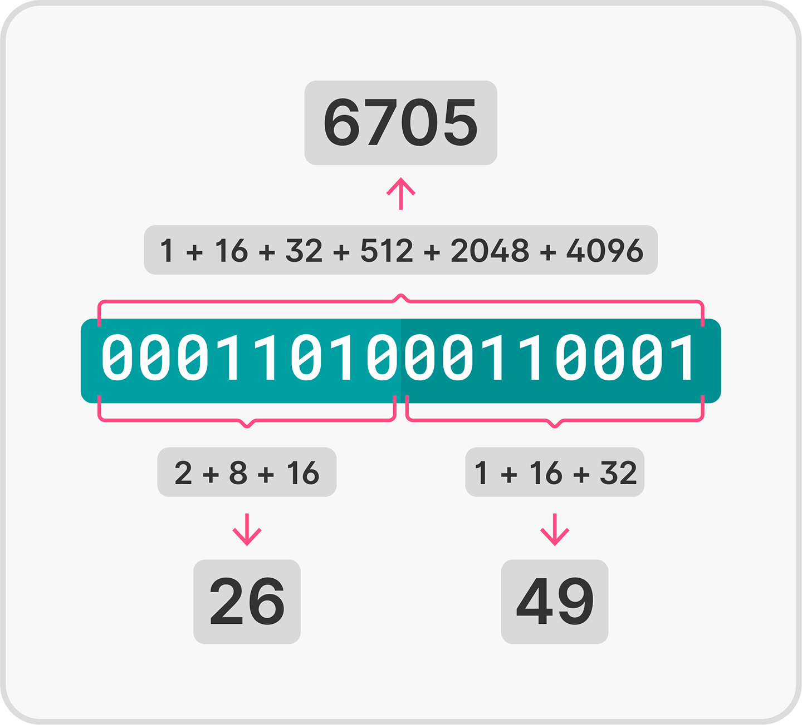

<!--
author:   Tilman Schieber
email:    tilman.schieber@tu-berlin.de
version:  1.0.0
date:     2024
language: de
narrator: Deutsch Female
logo:     img/3/logo.png
icon:     img/TU_Logo_kurz.svg
comment:  Ein Computer muss alles binär, also nur als Nullen und Einsen speichern. Wie können wir so Zahlen, Texte und sogar Bilder darstellen?
link:     styles/main.css
import:   ./macros.md

-->

# Kodierung

In diesem Kapitel lernen wir, wie wir Daten in einem Computer digital kodieren können. Kodieren bedeutet, dass wir uns ein Schema überlegen, mit dem wir Informationen in eine Form bringen können, die ein Computer versteht. Dies ermöglicht es, Zahlen, Texte, Bilder und Töne als Folge von Nullen und Einsen darzustellen.

<!-- class="context"-->
Für einen Gesamtüberblick über den Kurs geht es @[lialink(hier zurück zur Kursübersicht)](0_Inhalt.md).

## Bits und Bytes

Das Binärsystem erlaubt es uns, natürliche Zahlen direkt binär zu kodieren. Wir müssen aber jedesmal festlegen, wieviel Platz
wir für die Darstellung der Zahlen reservieren. Das bedeutet, wir entscheiden, wie viele Bits[^1] verwendet werden, um eine Zahl darzustellen. Diese Festlegung ist wichtig, da sie den Bereich der darstellbaren Werte begrenzt. Mit $n$ Bits können $2^n$ unterschiedliche Werte kodiert werden, also die ganzen Zahlen von $0$ bis $2^n-1$.

Beispiel
--------

Speichern wir binär die Zahlensequenz `0001101000110001`, so gibt es unterschiedliche Möglichkeiten, diese als natürliche Zahlen zu interpretieren:

1. **Als eine 16-stellige Binärzahl:** In diesem Fall lesen wir die Sequenz als eine einzige Zahl im Binärsystem und wandeln sie in eine Dezimalzahl um. Das ergibt den Wert 6705.

2. **Als zwei 8-stellige Binärzahlen:**  `00011010` und `00110001`. Diese werden separat interpretiert. Umgewandelt ergeben sie die Dezimalzahlen $26$ und $49$

Achtung
-------

Führende Nullen sollten immer mitgeschrieben werden, wenn eine Zahl in einer festen Bitlänge notiert wird. So ist die Darstellung eindeutig.
Die Zahl 8 schreiben wir in Bitlänge 4 als `1000`, in Bitlänge 8 jedoch als `00001000`.

Üblicherweise organisiert man die Bits in einem Computer in Blöcken zu acht Bit. Diese 8-Bit Blöcke nennt man ein Byte. Computer lesen meistens viele Bits und sogar mehrere Bytes auf einmal.

Die Anzahl der Bit, die ein Computer gleichzeitig liest, nennt man Bitbreite. In der Anfangszeit der Computer war diese Bitbreite 8-Bit (1 Byte) oder 16-Bit (2 Byte). Heutige Computer nutzen meist eine 64-Bit Architektur. Sie können also bis zu 8 Byte an Daten gleichzeitig verarbeiten.

Was ist die größte Zahl, die mit 8 Bit dargestellt werden kann?
---------------------------------------------------------------

- [[ ]] $256$
- [[X]] $255$
- [[ ]] $127$
- [[ ]] $512$
*************************

die größte Zahl ist $2^8-1=255$

*************************

[^1]: ein Bit ist eine *binary digit* oder binäre Stelle. 

## Big-endian und little-endian

Bei der digitalen Kodierung von Zahlen, die aus mehreren Bytes bestehen, muss man noch eine Entscheidung treffen: die Byte-Reihenfolge (*byte order* oder *endianness*).

* Bei einer **big-endian** Kodierung werden die Bytes so abgelegt, dass die höchsten Zweierpotenzen zuerst stehen. Das entspricht der Weise, wie wir Binärzahlen notieren. Ein alltägliches Beispiel für eine big-endian Darstellung ist die Uhrzeit: Wenn wir 17:05 Uhr schreiben, notieren wir zuerst die höherwertigen Stunden, dann die Minuten.

* Bei einer **little-endian** Kodierung ist die Byte-Reihenfolge umgedreht: Zuerst schreibt man das Byte, das die niedrigwertigsten Zweierpotenzen enthält und dann in aufsteigender Reihenfolge die weiteren. Ein Alltagsbeispiel für diese Schreibweise ist das Datum: Sprechen wir vom  20.01.2021, so schreiben wir zuerst den Tag, dann den Monat und dann das Jahr.

Beispiel
--------

Die Zahl 256 als 16-Bit big-endian Zahl schreibt man:

$$
00000001\; 00000000
$$

Die Zahl 256 als 16-Bit little-endian Zahl schreibt man:

$$
00000000\; 00000001
$$

**Tipp:** Wenn wir Zahlen notieren, die mehrere Byte groß sind, ist es oft einfacher, sie als Hexadezimalzahl zu schreiben. 
So schreiben wir 256 als 01 00 als big-endian und 00 01 als little-endian.

Die Wahl der Byte-Reihenfolge ist eine Entscheidung beim Computerdesign und für den Anwender meistens nicht wichtig.

Während viele Großrechner mit der big-endian Kodierung arbeiten, hat sich im Bereich der Personal Computer little-endian durchgesetzt.

Lückentext
----------

Es ist wichtig zu wissen, mit wie vielen Stellen eine binäre Zahl gespeichert wurde.
Ein [[ Byte | (Bit) | Trit | Pip ]] ist eine Stelle der binären Zahl, während [[ 4 | (8) | 16 | 32 ]] Bits ein Byte ergeben.
Moderne Computer haben in der Regel eine [[ 16-bit | 32-bit | (64-bit) | 128-bit ]] Architektur, was bedeutet, dass sie bis zu [[ 1 | 2 | 4 | (8) ]] Byte gleichzeitig verarbeiten können.\
Bei der digitalen Kodierung von Zahlen, die aus mehreren Bytes bestehen, muss man sich für eine Byte-Reihenfolge entscheiden. Es gibt zwei gängige Möglichkeiten:
big-endian, bei der die Bytes mit den [[ (höchsten) | niedrigsten | mittelhohen ]] Zweierpotenzen zuerst stehen, oder
[[ low-endian | small-endian | (little-endian) ]], bei der die Bytes mit den niedrigwertigsten Zweierpotenzen zuerst stehen.\
Die Wahl der Byte-Reihenfolge ist eine Entscheidung beim Computerdesign, und [[ big-endian | (little-endian) | middle-endian ]] hat sich im Bereich der Personal Computer durchgesetzt.

Was bedeutet Big-endian?
========================

> "Diese beiden großen Mächte führen, wie ich Ihnen berichten will, seit sechsunddreißig Monaten den heftigsten Krieg 
> mit einander. Letzterer begann auf folgende Weise: Ueberall wird zugestanden, daß die ursprüngliche Weise, Eier zu 
> öffnen, darin besteht, daß man das breitere Ende der Schale zerbricht oder abschneidet. Allein der Großvater Seiner 
> gegenwärtigen Majestät schnitt sich, da er als Knabe einst ein Ei essen wollte, bei dieser Gelegenheit in den Finger.
>  Darauf publicirte der Vater ein Edikt, welches allen Unterthanen bei schwerer Strafe verbot, das breitere Ende des 
> Eies zu eröffnen. Das Volk gerieth über dieses Gesetz in solche Wuth, daß sechs Rebellionen bei der Gelegenheit
> entstanden."
>
> -- Jonathan Swift: "Reise nach Lilliput"

Der Begriff *Big-endian* hat seinen Ursprung aus [Jonathan Swifts Roman "Reise nach Lilliput"](https://www.projekt-gutenberg.org/swift/lilliput/). In der Geschichte gibt es eine satirische Auseinandersetzung zwischen den Bewohnern von Lilliput und Blefuscu darüber, auf welcher Seite ein gekochtes Ei aufzuschlagen ist – am "großen Ende" (big end) oder am "kleinen Ende" (little end). Swift nutzte diesen Streit als Parodie auf triviale, aber dennoch eskalierende Konflikte.

Diese Analogie wurde auf die Computerwelt übertragen, um die manchmal hitzige Debatte darüber zu beschreiben, wie Daten geordnet werden sollten.

## Kodierung ganzer Zahlen

Bisher haben wir gelernt, wie natürliche Zahlen $\mathbb{N}$ binär kodiert werden können.

Um auch die ganzen Zahlen $\mathbb{Z}$ darstellen zu können, müssen wir uns auf eine Kodierung für negative Zahlen einigen.

Auf den ersten Blick ist das einfach zu lösen, schließlich ist das Vorzeichen einer Zahl entweder positiv oder negativ. Wir können es also mit einem Bit kodieren.

So könnten wir vereinbaren, dass eine Zahl ein negatives Vorzeichen hat, wenn ihr höchstwertigstes Bit $1$ ist. Sie wäre positiv, wenn dieses Bit eine $0$ ist.

Beispiel
--------

Nutzen wir das höchstwertigste Bit(an Position 7), um das Vorzeichen zu repräsentieren, so steht die 8-Bit Binärzahl $00000010$ für $2$. 

Die Zahl $10000010$ steht dann für $-2$.

Auch wenn diese Darstellung einfach zu lesen ist, hat sie ihre Nachteile:

* Null kann nicht eindeutig dargestellt werden, sowohl $10000000$ als auch $00000000$ steht für $0$.
* Man kann mit dieser Zahlendarstellung nicht ohne weiteres rechnen: Es muss immer eine Fallunterscheidung für negative und positive Zahlen gemacht werden.

### Zweierkomplement

Eine Alternative zum naiven Abspeichern des Vorzeichens, ist das sogenannte *Zweierkomplement*. Auch wenn es etwas schwieriger zu bilden ist, erlaubt es uns sehr einfache Rechenoperationen mit negativen Binärzahlen.
 
Im Zweierkomplement werden positive Zahlen wie üblich dargestellt. Die 8-Bit Zahl $00000010$ steht also für $+2$. 

Negative Zahlen schreibt man mit der folgenden Methode:

Das Zweierkomplement bilden:
----------------------------

1. Repräsentieren Sie die Zahl ohne Vorzeichen binär in der gewünschten Bitbreite.
2. Bilden Sie das *Komplement* (Auch *Einerkomplement* genannt) indem Sie jede Ziffer in ihr Gegenteil verkehren: 

    * $0$ wird zu $1$ und 
    * $1$ wird zu $0$.

3. Addieren Sie $1$ zum Ergebnis. Wird das Ergebnis der Addition durch einen Übertrag 9-stellig, verwerfen Sie diese neunte Stelle (siehe auch Beispiel 2).

Beispiel 1: 
-----------

Um $-2$ im 8-<nolink>Bit</nolink> <nolink>Zweierkomplement</nolink> zu repräsentieren ...

1. repräsentiert man $2$ als $00000010$
2. bildet man das Komplement $11111101$
3. addiert man $1$ und erhält $11111110$

Beispiel 2: 
-----------

Versuchen wir $-0$ im 8-<nolink>Bit</nolink> <nolink>Zweierkomplement</nolink> zu repräsentieren ...

1. repräsentiert man $0$ als $00000000$
2. bildet man das Komplement $11111111$
3. addiert man $1$ und erhält das 9-stellige Ergebnis $100000000$. Man verwirft die 9.Stelle und erhält als Ergebnis $00000000$.

Wir sehen also, dass $-0$ und $0$ im <nolink>Zweierkomplement</nolink> mathematisch korrekt die gleiche Zahl sind.

Aufgabe:
--------

Probieren Sie es nun selbst:

Wie stellt man die negative Zahl -64 im 8-bit Zweierkomplement dar?

- [[ ]] `10111100`
- [[ ]] `10111101`
- [[X]] `11000000`
- [[ ]] `11000100`
*************************

Ja. Die positive Binärzahl 64 stellt man als `01000000` dar.\
Das Komplement davon ist `10111111`.\
Das Zweierkomplement ist damit `11000000`.

*************************

### Interaktiver Rechner

> Hier können Sie nun selbst ausprobieren, wie Zahlen in das Zweierkomplement umgewandelt werden.

@[embed(style="height: 450px; width:450px; border: none")](html/3/zweierkomplement.html)

## Kodierung rationaler Zahlen

Schon bei den einfachsten Divisionsaufgaben stößt die Arithmetik mit Ganzzahlen an ihre Grenzen. Wie stellt man $1/2=0,\negthinspace5$ oder $1/3=0,\negthinspace\bar{3}$ in einem Computer dar? 

Eine Zahl der Form $1,\negthinspace5$ oder $0,\negthinspace234$ nennt man auch Dezimalbruch. 

So steht $0,\negthinspace125$ für $\frac{1}{10}+\frac{2}{100}+\frac{5}{1000}$. 

Da der Kehrbruch einer Zehnerpotenz auch als Zehnerpotenz mit negativem Exponenten geschrieben werden kann, können wir ebenfalls $1 \cdot 10^{-1}+2 \cdot 10^{-2}+5 \cdot 10^{-3}$ schreiben.

Die Darstellung eines Dezimalbruchs entspricht also den Regeln unseres dezimalen Positionssystems. 

Genauso können wir eine rationale Zahl als Binärbruch darstellen.
Der Binärbruch $0,\negthinspace1_2$ entspricht dann $2^{-1}=\frac{1}{2}$. 

Beispiel
--------

Wir betrachten $1,\negthinspace1011_2$.
Geschrieben als Zweierpotenzen entspricht das:

$$
2^0+2^{-1}+2^{-3}+2^{-4}
$$

oder

$$
1+\frac{1}{2}+\frac{1}{8}+\frac{1}{16}=\frac{27}{16}
$$

geschrieben als Dezimalbruch:

$$
1,\negthinspace6875
$$

Das bedeutet, auch rationale Zahlen mit Nachkommastellen können als Binärzahl gespeichert werden. Man muss aber ebenfalls die Information speichern, an welcher Stelle das Komma steht.
In der Informatik wird dafür eine besonders platzsparende und flexible Lösung verwendet, die *Fließkommazahlen*.

Aufgabe 1
----------

Wie stellt man den Dezimalbruch $3,\negthinspace75$ als Binärzahl dar?

- [(X)] `11,11`
- [( )] `11,101`
- [( )] `1,11`
*************************

$3,\negthinspace75$ entspricht $2^1+2^0+2^{-1}+2^{-2}=2+1+0,\negthinspace5+0,\negthinspace25=3,\negthinspace75$

*************************

Aufgabe 2
----------

Welchem Wert entspricht der binäre Bruch `0.0101`?

- [( )] $0,\negthinspace75$
- [( )] $0,\negthinspace25$
- [(X)] $0,\negthinspace3125$
*************************

$0,\negthinspace3125$ entspricht $2^{-2}+2^{-4}=0,\negthinspace25+0,\negthinspace0625=0,\negthinspace3125$

*************************

### Fließkommazahlen

Fließkommazahlen basieren auf dem Prinzip der wissenschaftlichen Notation. Das ist eine Methode, besonders kleine oder große Zahlen zu notieren.

In der Chemie ist Ihnen wahrscheinlich schon die Einheit 1 mol für die Stoffmenge begegnet. 
Ein mol besteht aus 

$$
602\;214\;076\;000\;000\;000\;000\;000
$$

Teilchen. Einfacher schreibt man das als 

$$
6,\negthinspace02214076 \cdot 10^{23}
$$

Das Video zeigt, wie man durch Verschieben des Kommas zu dieser Schreibweise kommt:

<video controls width="450" height="200">
    <source src="img/3/fliesskomma1.mp4" type="video/mp4">
</video>

Aus der Physik kennen Sie das Elektron, ein sehr leichtes Elementarteilchen. Es wiegt

$$
0,\negthinspace 000\; 000\;000\;000\;000\;000\;000\;000\;000\;000\;9 
$$
Gram oder einfacher

$$
9\cdot 10^{-31}
$$
Gramm.

Das Video zeigt, wie das funktioniert: 

<video controls width="640" height="200">
    <source src="img/3/fliesskomma2.mp4" type="video/mp4">
</video>

Man verschiebt also das Komma so, dass nur noch eine Ziffer vor dem Komma steht. Dann multipliziert man diese Kommazahl mit einer Zehnerpotenz, so dass sich der korrekte Wert ergibt. 
Allgemeiner multipliziert man die sogenannte Mantisse mit einer Basis, hoch eines Exponenten:

$$
\text{Mantisse} \cdot \text{Basis}^{\text{Exponent}}
$$

Die Mantisse hat stets genau eine Zahl vor dem Komma.

Computer verwenden bei Fließkommazahlen die Basis 2 und speichern auch die Mantisse und den Exponenten als Binärzahlen. Die gebräuchlichsten Formate sind die 32-Bit Fließkommazahl und die 64-Bit Fließkommazahl.

Bei den inzwischen überwiegend gebrauchten 64-Bit Fließkommazahlen werden 

* 1 Bit für das Vorzeichen (positiv oder negativ),
* 11 Bit für den Exponenten und
* 52 Bit für die Mantisse verwendet.

So lassen sich nicht nur Zahlen mit Nachkommastellen darstellen, sondern auch sehr kleine (bis zur Größenordnung $10^{-308}$ ) und sehr große Zahlen (bis zur Größenordnung $10^{308}$ ). 
Um diesen großen Zahlenbereich abzudecken, muss man Kompromisse bei der Genauigkeit hinnehmen. Selbst bei einfachen Rechenvorgängen mit Fließkommazahlen kann es zu Ungenauigkeiten und damit zu Fehlern im Ergebnis kommen.

Aufgabe
--------

Welche der folgenden Aussage über Fließkommazahlen sind korrekt?
- [[X]] Fließkommazahlen basieren auf dem Prinzip der wissenschaftlichen Notation.
- [[X]] Fließkommazahlen bestehen aus einem Vorzeichen, einem Exponenten und einer Mantisse.
- [[ ]] Fließkommazahlen haben eine feste Anzahl an Nachkommastellen.
- [[X]] Fließkommazahlen können zu Ungenauigkeiten führen.
- [[ ]] Fließkommazahlen haben eine feste Anzahl an Vorkommastellen.
- [[ ]] Fließkommazahlen können nur positive Zahlen darstellen.

## Textkodierung

Sie haben nun gesehen wie wir verschiedene Arten von Zahlen in einem Computer speichern können. 
Ein logischer nächster Schritt, ist es menschliche Sprache -- also Texte -- in einem Computer speichern zu können. Indem wir Buchstaben, Zahlen und Sonderzeichen durchnummerieren und diese Nummern binär kodieren, ist das problemlos möglich.

Eine der ersten Kodierungen für Texte war die ASCII-Kodierung. ASCII steht für *American Standard Code for Information Interchange*.

ASCII kodiert $2^7=128$ Symbole in $7$ Bit. Die ersten $32$ Symbole sind Steuerzeichen[^1], wie zum Beispiel der Zeilenumbruch oder der Tabulator. Die restlichen $96$ Symbole sind Buchstaben, Zahlen und Sonderzeichen.

@[embed(style="height: 450px; width:500px; border: none")](html/3/ascii.html)

ASCII hat mit nur $128$ Symbolen seine Grenzen und ist auf das englische Alphabet beschränkt.
Die inzwischen universell verwendete Kodierung für Texte ist Unicode[^2]. Unicode ist ein Kodierungsstandard, der es ermöglicht, Texte in fast allen Schriftsystemen der Welt darzustellen.
Es gibt verschiedene Varianten von Unicode, die bekannteste ist UTF-8. Ein Zeichen wird mit 1 bis 4 Byte kodiert[^2]. In der folgenden Tabelle sehen Sie einige Beispiele:

<!-- data-type="none" -->
| Symbol | Hexadezimal | Binäre Kodierung             | Erklärung                          |
|--------|-------------|------------------------------|-------------------------------------|
| A      | 0041        | 01000001                     | Englischer Buchstabe, wie ASCII    |
| ä      | 00E4        | 11000011 10100100           | Deutscher Umlaut                    |
| ñ      | 00F1        | 11000011 10110001           | Spanischer Buchstabe               |
| π      | 03C0        | 11001111 10110000           | Griechischer Buchstabe, Pi         |
| Я      | 042F        | 11010000 10101011           | Russischer Buchstabe               |
| ॐ      | 0950        | 11100001 10100101 10010000  | Sanskrit-Symbol für Frieden        |
| ∞      | 221E        | 11100010 10001000 10011110  | Mathematisches Symbol für Unendlichkeit |
| ♠      | 2660        | 11100010 10011000 10100000  | Spielkarten-Symbol: Pik            |
| さ      | 3055        | 11100011 10000010 10010101  | Japanischer Buchstabe             |
| 中     | 4E2D        | 11100100 10111010 10101101  | Chinesisches Zeichen für „Mitte“   |
| 😊     | 1F60A       | 11110000 10011111 10011000 10101010 | Emoji für Lächeln             |
| 🐉     | 1F409       | 11110000 10011111 10010000 10001001 | Emoji für einen Drachen           |
| 𒀀    | 12000       | 11110000 10100100 10000000 10000000 | Sumerische Keilschrift              |
| 𓀀    | 13000       | 11110000 10110000 10000000 10000000 | Ägyptisches Hieroglyphen-Zeichen   |

[^1]: Viele der ASCII Steuerzeichen kommen aus einer Zeit in der Computer noch mit Lochkarten und Lochbändern arbeiteten. Sie wurden verwendet um den Drucker oder das Terminal zu steuern. Lassen sie sich also nicht von den seltsamen Namen irritieren.

[^2]: UTF-8 ist abwärtskompatibel mit ASCII, das bedeutet, dass die ersten $128$ Zeichen von UTF-8 genau so kodiert sind wie in ASCII. Das macht es einfach, Texte in ASCII in UTF-8 zu konvertieren.

## Bilder, Töne, Videos

Bilder
------

Aus den Grundbausteinen, die sie nun bereits kodieren können, lassen sich nun mit einigen Strategien und Ideen fast beliebig komplexe Daten kodieren.

Wollen wir beispielsweise ein Bild kodieren, so können wir es in ein Raster von Bildpunkten (oder auch *Pixel*) zerlegen. Dessen Farbe kann dann als Kombination von Rot, Grün und Blau gespeichert werden. 
Die Intensität der jeweiligen Farbe wird in der Regel als einfache Zahl zwischen 0 und 255 gespeichert.

> Bewegen Sie die Maus über dieses Bild, um die Zahlenwerte der jeweiligen Bildpunkte *(Pixel)* zu sehen:

@[embed(style="height: 500px; width:700px; border: none")](html/3/pixelexplorer.html)

### Töne und Musik

@[embed(style="height: 320px; width:700px; border: none")](html/3/soundwave.html)

Töne und Musik können als *waveform* (deutsch auch "Wellenform") dargestellt werden. Die Amplitude der Welle wird in regelmäßigen Abständen abgetastet und als Zahl gespeichert. Diese Methode wird als Abtastung oder auch *Sampling* bezeichnet. Je höher die Abtastrate, desto genauer wird der Ton erfasst. Bei der CD-Qualität beträgt die Abtastrate beispielsweise 44.100 Mal pro Sekunde (44,1 kHz), was bedeutet, dass der Ton 44.100 Mal in der Sekunde gemessen wird. Jede dieser Messungen wird als Zahl gespeichert und repräsentiert die Höhe (Amplitude) der Schallwelle zu diesem Zeitpunkt. Zusätzlich wird für jede Messung eine Bittiefe angegeben, welche die Genauigkeit der Messung bestimmt. Bei einer Bittiefe von 16 Bit, wie es bei CDs üblich ist, stehen 65.536 verschiedene Werte zur Verfügung, um die Amplitude darzustellen.

Je nach Qualität und Länge einer Tonaufnahme können sehr große Datenmengen entstehen. Auch hier werden häufig Verfahren zur **Kompression** eingesetzt, um die benötigte Datenmenge zu reduzieren. Eine verbreitete Methode ist die **verlustbehaftete Kompression**, bei der weniger wahrnehmbare Informationen entfernt werden, wie es beispielsweise beim MP3-Format der Fall ist.

Aufgabe
-------

Eine unkomprimierte Stereo-Audiodatei wird mit einer Abtastrate von 44,1 kHz und einer Bittiefe von 16 Bit aufgenommen. Die Aufnahme dauert 5 Minuten. Wie groß ist die resultierende Datei? 

**Lösungsschritte:**  

1. **Abtastrate (Hz)** = 44.100  
2. **Bittiefe (Bit)** = 16  
3. **Kanäle** = 2 (Stereo)  
4. **Dauer (Sekunden)** = 5 Minuten × 60 = 300 Sekunden  

Die Dateigröße in Bytes erhalten Sie dann durch die folgende Formel:  
$$ \text{Größe} = \text{Abtastrate} \times \text{Bittiefe} \times \text{Kanäle} \times \text{Dauer (s)} \div 8 $$

- [( )] 16.644.096 Bytes  
- [( )] 27.136.512 Bytes  
- [(X)] 52.920.000 Bytes  
- [( )] 108.324.864 Bytes  
*************************

\[
\text{Dateigröße (Bytes)} = 44.100 \times 16 \times 2 \times 300 \div 8 = 52.920.000 
\]

*************************

### Videos

Videos sind eine Kombination aus Bild und Ton. Ein Video besteht aus einer Abfolge von Einzelbildern (sogenannten *Frames*), die schnell genug hintereinander abgespielt werden, um eine flüssige Bewegung zu erzeugen. Üblicherweise werden pro Sekunde 24 bis 60 Bilder angezeigt, je nach Anwendungsbereich und Qualitätsanforderung. Diese Bildfolge wird mit Ton kombiniert.

Bei Videos fallen daher enorme Datenmengen an, insbesondere wenn sowohl die Einzelbilder als auch das Audiosignal in hoher Qualität vorliegen. In der Praxis kommen deshalb spezielle Kompressionsverfahren zum Einsatz. So wird die Dateigröße verringert, oft ohne die wahrgenommene Qualität merklich zu beeinträchtigen.

Beispiel
--------

Ein HD-Video hat eine Auflösung von 1920 x 1080. Um die Farbwerte für Rot, Grün und Blau zu speichern benötigt jeder Pixel 3 Byte.
Jeder *frame* des Videos benötigt also unkomprimiert

$$
1920 \cdot 1080 \cdot 3 \; \text{bytes} = 6\,220\,800 \; \text{bytes}
$$

Eine Minute Video bei 30 fps (*frames* pro Sekunde) benötigt also

$$
6\,220\,800 \; \text{bytes} \cdot 30 \cdot 60 = 11\,197\,440\,000\; \text{bytes}
$$

Damit benötigt nur eine Minute Video schon über 11 Gigabyte. Dank moderner Kompressionsalgorithmen benötigt eine Minute Video in hoher Qualität (HD) auf Youtube benötigt aber nur ca. 60 Megabyte.

