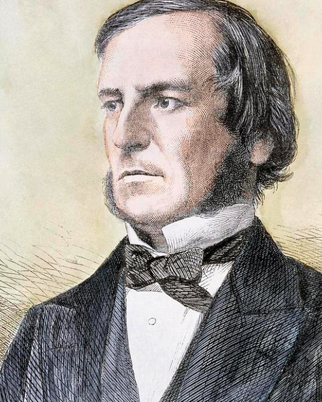

<!--
author:   Tilman Schieber
email:    tilman.schieber@tu-berlin.de
version:  1.0.0
date:     2024
language: de
narrator: Deutsch Female
logo:     img/4/logo.png
icon:     img/TU_Logo_kurz.svg
comment:  Boolesche Logik, Schaltkreise 
link:     styles/main.css
import:   ./macros.md

-->

# Schaltkreise

So wie wir aus einzelnen Bits komplexe Daten kodieren können, lässt sich ein kompletter Computer bauen, indem die logischen Operationen `UND`, `ODER` und `NICHT` kombiniert werden. Zunächst lernen wir, mithilfe der Booleschen Algebra logische Berechnungen durchzuführen, und konstruieren anschließend Schaltkreise aus Gattern. Schließlich erfahren wir, wie komplexere Funktionalitäten wie Addition oder Multiplikation realisiert werden können.

<!-- class="context"-->
Dieses Kapitel baut auf der @[lialink(Einführung in die Aussagenlogik)](1_Aussagenlogik.md) auf.\
Für einen Gesamtüberblick über den Kurs geht es @[lialink(hier zurück zur Kursübersicht)](0_Inhalt.md).

## Boolesche Logik

Den Begriff der Algebra kennen Sie sicherlich aus der Mathematik. Er beschreibt einen Satz von Regeln, mit dem man Berechnungen durchführen kann. So erklärt die elementare Algebra, wie wir Zahlen addieren, multiplizieren, substrahieren und dividieren können. Sie verwendet Variablen und erlaubt uns Gleichungen und Ungleichungen aufzustellen. Dabei legt sie fest, welche Regeln man dabei beachten muss.

Die boolesche Algebra hat ihren Namen von George Boole, der sie 1847 in seinem Buch *„The Mathematical Analysis of Logic”* erfand.

Sie ist eine besondere Form der Algebra, die Regeln beschreibt, wie man mit Wahrheitswerten[^1] rechnen kann.

[^1:] Die Grundlagen der Aussagenlogik finden Sie im @[lialink(ersten Kurskapitel)](1_Aussagenlogik.md)

## Schaltkreise